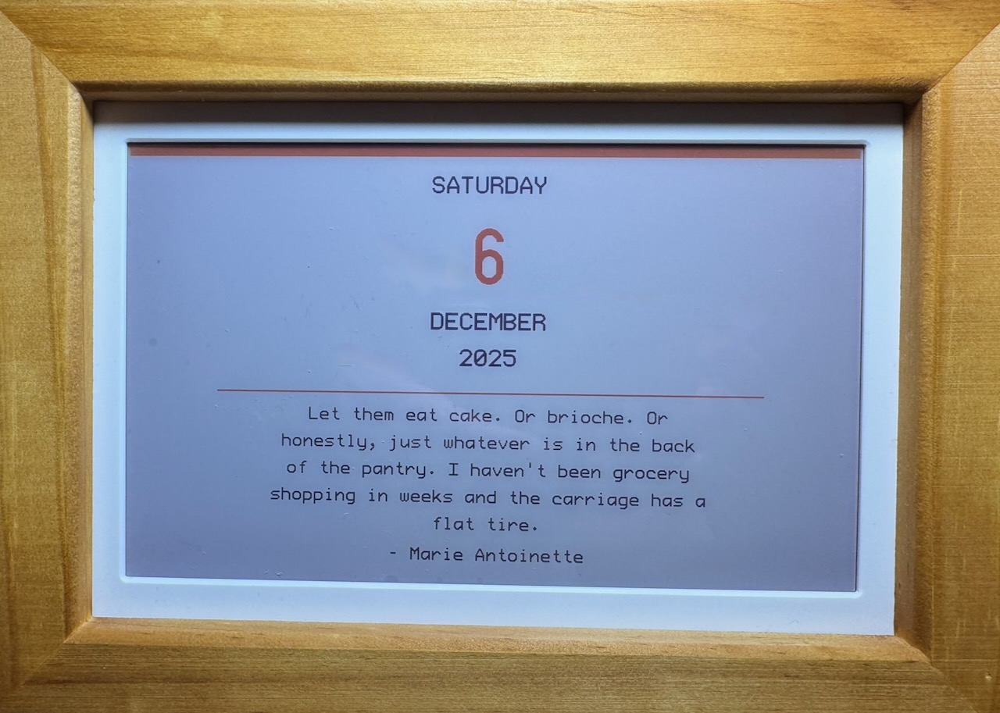

# Waveshare PhotoPainter in Rust

A modern re-implementation in Rust of the firmware for the **Waveshare 7.3" (F) Color E-Paper PhotoPainter** - a battery-powered digital picture frame with a 7-color e-ink display.



## Features

- ✅ **7-Color E-Paper Display** (800x480) - Black, White, Red, Yellow, Green, Blue
- ✅ **Daily Calendar Display** - Automatic calendar page with date, day of week, and daily quote
- ✅ **USB Console Interface** - Interactive serial terminal for development and testing
- ✅ **Real-Time Clock** - PCF85063 with persistent timekeeping and alarm functionality
- ✅ **Automatic Wake-Up** - Displays fresh calendar at 6am daily via RTC alarm
- ✅ **Battery Management** - Voltage monitoring, charging detection, low-battery protection, auto power-off
- ✅ **Random Walk Art** - Built-in procedural art generation
- ✅ **Large, Readable Fonts** - ProFont 24pt and u8g2 62pt fonts for excellent readability
- 🚧 **SD Card Support** - Planned for loading custom images

## Quick Start

### Prerequisites

1. **Install Rust** (1.75 or later):
   ```bash
   curl --proto '=https' --tlsv1.2 -sSf https://sh.rustup.rs | sh
   ```

2. **Add thumbv6m target**:
   ```bash
   rustup target add thumbv6m-none-eabi
   ```

3. **Install elf2uf2-rs**:
   ```bash
   cargo install elf2uf2-rs
   ```

### Building and Flashing

1. **Build the firmware**:
   ```bash
   cargo build --release
   ```

2. **Flash to device** (hold BOOTSEL button while connecting USB):
   ```bash
   cargo run --release
   ```

### Using the USB Console

When powered via USB, the device enters console mode:

1. Connect via USB-C cable
2. Open a serial terminal (115200 baud, 8N1):
   ```bash
   # macOS/Linux
   picocom -b 115200 /dev/ttyACM0

   # Or use screen
   screen /dev/ttyACM0 115200
   ```
3. Type `HELP` to see available commands

#### Available Commands

**Display Commands:**
- `DRAWCALENDAR` (or `GO`) - Display calendar page with current date and daily quote
- `DRAWRANDOM` - Generate and display random walk art
- `CLEAR` - Clear display to white

**Time Commands:**
- `TIME` - Show current RTC time
- `SETTIME Y M D H M S` - Set RTC time (e.g., `SETTIME 2025 12 6 14 30 0`)
- `SLEEP n` - Deep sleep for n seconds (RTC alarm wake-up)

**System Commands:**
- `BATTERY` - Show battery voltage and charging status
- `VERSION` - Show firmware version with build date
- `RESET` - Soft reset device
- `DFU` - Reboot to USB bootloader (UF2 mode) for firmware updates
- `HELP` or `?` - Show command list

## Hardware

- **MCU**: Raspberry Pi RP2040 (Cortex-M0+ dual-core)
- **Display**: Waveshare 7.3" EPD 7-color e-paper (SPI)
- **RTC**: PCF85063 Real-Time Clock (I2C)
- **Storage**: SD Card slot (future support)
- **Power**: Battery with USB-C charging

## How It Works

### Battery Mode (Normal Operation)
When powered by battery:
1. Device wakes up at 6am (or on first boot)
2. Displays a calendar page with:
   - Current day of week in large text
   - Huge day number (62px tall)
   - Month name and year
   - Daily quote (rotates through 61 absurd historical quotes)
3. Sets RTC alarm for 6am the next day
4. Powers down to conserve battery
5. Automatically wakes at 6am to display fresh calendar

### USB Console Mode
When USB power is detected:
- Enters interactive console mode for testing and configuration
- Display can be updated via commands
- RTC time can be set
- Full access to all system features

## Architecture

Built with modern **async/await** Rust using the **Embassy framework**:
- Non-blocking I/O for all hardware peripherals
- Efficient power management with automatic sleep/wake cycles
- Clean separation of concerns
- Type-safe peripheral access
- Large, readable fonts (ProFont 24pt, u8g2 62pt) optimized for e-paper
- 180° display rotation for proper orientation

## Documentation

For detailed technical documentation, see [CLAUDE.md](CLAUDE.md).

## License

This project is a re-implementation of Waveshare's original C firmware.

## Acknowledgments

- Original firmware by Waveshare team
- Built with [Embassy](https://embassy.dev/) async embedded framework
